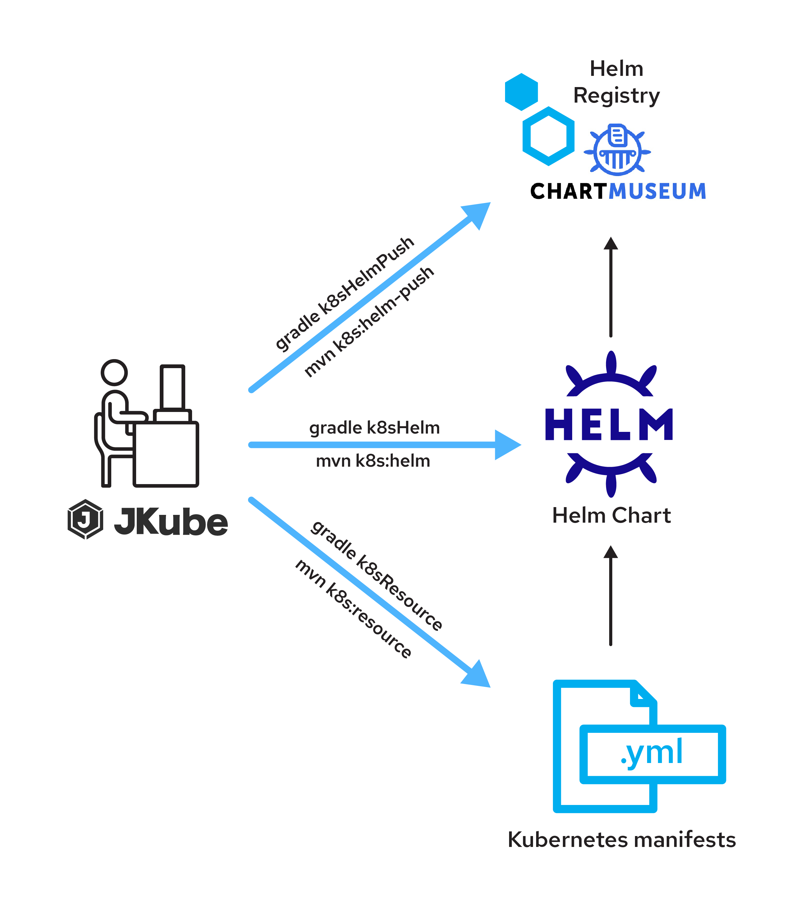

# Despliegue y gestion de contenedores usando la herramienta helm

Acontinuación se explicara como hacer la instalacion de servicios con la herramienta helm la cual servira como gestor de despliegues de contenedores ademas de permiter versinamiento y automatizacion, Helm ayuda a administrar las aplicaciones de Kubernetes como definir, instalar y actualizar las App mas complejas. 



> **NOTA** Aqui podras encontrar la aplicacion donde explican con mas detalle lo mencionado [Pagina helm chart](https://helm.sh)

Primero se explicara como instalar cada una de las herramientas necesarias para el despliegue de la aplicacion y despues se mostrara el paso a paso para el entorno

Para el entorno se necesitaran dos maquinas virtuales, la primera se instalara lo siguiente
- minikube driver docker
- kubectl
- nginx-proxy

Para la segunda maquina
- kubectl
- helm

Donde la VM1 sera el clouster de kubernetes por ello se necesita minikube y con la VM2 se gestionara el despliegue mediante el proxy con la herramienta helm chart

## Instalacion de Docker-Kubernetes, minikube-kubectl, helm chart y nginx-proxy

## - Instalacion de docker
Para la instalacion de Dcoker se tiene que lanzar los siguientes comando:

> **NOTA** Para mas informacion sobre la instalacion de Docker acceder al siguiente link [Docker_install](https://docs.docker.com/engine/install/ubuntu/)

```bash
sudo apt-get update
sudo apt-get install -y apt-transport-https ca-certificates curl gnupg lsb-release software-properties-common net-tools
sudo mkdir -p /etc/apt/keyrings
curl -fsSL https://download.docker.com/linux/ubuntu/gpg | sudo gpg --dearmor -o /etc/apt/keyrings/docker.gpg
echo "deb [arch=$(dpkg --print-architecture) signed-by=/etc/apt/keyrings/docker.gpg] https://download.docker.com/linux/ubuntu $(lsb_release -cs) stable" | sudo tee /etc/apt/sources.list.d/docker.list > /dev/null
sudo apt-get update
sudo apt-get install docker-ce docker-ce-cli containerd.io docker-compose-plugin
```
Con esto estaria instalado el docker engine, ahora para dar permisos de root

```bash
sudo groupadd docker
sudo usermod -aG docker $USER
exec "$SHELL"
exit
reboot
docker ps -a
```

Despues se debe realizar la instalacion de docker compose que es un plugin necesario para el despliegue de la aplicación

```bash
DOCKER_CONFIG=${DOCKER_CONFIG:-$HOME/.docker}
mkdir -p $DOCKER_CONFIG/cli-plugins
curl -SL https://github.com/docker/compose/releases/download/v2.7.0/docker-compose-linux-x86_64 -o $DOCKER_CONFIG/cli-plugins/docker-compose
chmod +x $DOCKER_CONFIG/cli-plugins/docker-compose
sudo mv $DOCKER_CONFIG/cli-plugins/docker-compose /usr/local/bin/docker-compose
```

##  - Instalacion de kubernetes
Se procede a instalar kubernetes, esta es una plataforma con la cual se realiza el despliegue de multiples contenedores, escalamiento y automatiazcion de codigo libre.


Se actualiza paquetes y se instala las dependencias de minikube

> **NOTA** Minikube es un clúster de Kubernetes (k8s) de un solo nodo, proporciona una interfaz de línea de comandos para administrar el clúster de Kubernetes (k8s) y su componente.

```bash
sudo apt update -y
sudo apt upgrade -y
sudo apt install -y curl wget apt-transport-https
```
Ahora se instalaran los binarios de minikube

```bash
wget https://storage.googleapis.com/minikube/releases/latest/minikube-linux-amd64
sudo cp minikube-linux-amd64 /usr/local/bin/minikube
sudo chmod +x /usr/local/bin/minikube
```

Se verifica la version de minikube

```bash
minikube version
```

se tendra que ver de la siguiente forma

```bash
minikube version: v1.28.0
commit: 986b1ebd987211ed16f8cc10aed7d2c42fc8392f
```

## - Instalacion de kubectl y despliegue de minikube-docker
Para la instalacion de kubectl primero se descarga con un curl la ultima version de esta

> **Nota** Kubectl es una utilidad de línea de comandos que se utiliza para interactuar con el clúster de Kubernetes; se usa para administrar implementaciones, servicios y pods, etc.

```bash
curl -LO https://storage.googleapis.com/kubernetes-release/release/`curl -s https://storage.googleapis.com/kubernetes-release/release/stable.txt`/bin/linux/amd64/kubectl
chmod +x kubectl
sudo mv kubectl /usr/local/bin/
```

Se verifica la version de kubectl con el siguiente comando

```bash
kubectl version -o yaml
```

Se tendra que mostrar de la siguiente manera

```bash
clientVersion:
  buildDate: "2022-11-09T13:36:36Z"
  compiler: gc
  gitCommit: 872a965c6c6526caa949f0c6ac028ef7aff3fb78
  gitTreeState: clean
  gitVersion: v1.25.4
  goVersion: go1.19.3
  major: "1"
  minor: "25"
  platform: linux/amd64
kustomizeVersion: v4.5.7
serverVersion:
  buildDate: "2022-10-12T10:49:09Z"
  compiler: gc
  gitCommit: 434bfd82814af038ad94d62ebe59b133fcb50506
  gitTreeState: clean
  gitVersion: v1.25.3
  goVersion: go1.19.2
  major: "1"
  minor: "25"
  platform: linux/amd64
```

Para iniciar el minikube con el controlador de docker se lanza la siguiente linea de comando

```bash
minikube start --driver=docker
```

Si se desea iniciar minikube con recursos personalizados y que el minikube seleccione automaticamente el controlador, se ejecuta la siguiente linea de comandos

```bash
minikube start --addons=ingress --cpus=2 --cni=flannel --install-addons=true --kubernetes-version=stable --memory=6g
```

Se verifica si minikube esta corriendo

```bash
minikube status
minikube
type: Control Plane
host: Running
kubelet: Running
apiserver: Running
kubeconfig: Configured
```

Se ejecuta el comando kubectl para verificar la versión de Kubernetes, el estado del nodo y la información del clúster.

```bash
kubectl cluster-info
kubectl get nodes
```
Para mas informacion se recomienda ver el siguiente link donde se muestra con mas detalle la instalacion para el clouster de minikube [Install_minikube](https://www.linuxtechi.com/how-to-install-minikube-on-ubuntu/)

## - Instalacion de helm_chart
Por ultimo para la instalacion de Helm_chart se descarga la version mas actual del siguiente repositorio de github [repository_helm](https://github.com/helm/helm/releases)

```bash
sudo apt update && sudo apt -y upgrade
mkdir helm-chart
cd helm-chart
wget https://get.helm.sh/helm-v3.10.2-linux-amd64.tar.gz
tar -zxvf helm-v3.10.2-linux-amd64.tar.gz
mv linux-amd64/helm /usr/local/bin/helm
curl https://baltocdn.com/helm/signing.asc | gpg --dearmor | sudo tee /usr/share/keyrings/helm.gpg > /dev/null
sudo apt-get install apt-transport-https --yes
echo "deb [arch=$(dpkg --print-architecture) signed-by=/usr/share/keyrings/helm.gpg] https://baltocdn.com/helm/stable/debian/ all main" | sudo tee /etc/apt/sources.list.d/helm-stable-debian.list
sudo apt-get update
sudo apt-get install helm
```
Se verifica la version de helm

```bash
helm version
version.BuildInfo{Version:"v3.10.2", GitCommit:"50f003e5ee8704ec937a756c646870227d7c8b58", GitTreeState:"clean", GoVersion:"go1.18.8"}
```

## - Instalacion de Nginx-proxy
Como paso adicional se instala un proxy de la siguiente manera

![](data:image/png;base64,iVBORw0KGgoAAAANSUhEUgAAASYAAACrCAMAAAD8Q8FaAAABI1BMVEX////09PRQnlIAAAD5+fn39/ePkJGUmJb29/ZjZGbCw8Pu7u7N0M6kpKX8/PzZ2tplZmgIAADi4+NfYGIgGxwZFRXp6emrq6tp1ndEmke+079aoVxISUl8vYB5fHxo1XYwMi+9vr6DhYNYrV7J1clsbm/S7dXd3d0nIiNYV1fT09O3t7dxc3TZ7tz79vtw131/14o7Ojlz1YDp9OuI2ZI+lkBb1GweHRszMDFFQ0OQ15lpX2uq3rCf3ae+4MLh6OLG6sqz47lyxX1smHOwzLO+4sJrdG9vjHRwqHeCs4VflGGSw5W0vLZoZGtyv3xymHhvg3O5z7qhyaQlKiZIqE6GkIlpp2yEf4bPyM+ktKdoWmpWrFu4srmJsY/Y5dmJuYyLnYwuPhP7AAAdDUlEQVR4nO2di3+b1pLHwbzEUwgkwK0CgRYjAQZLsh3Z8SNO49t2u2677d307u297v7/f8WeB0ggoTdS4s9m2loKll3pmznDnHN+M4cgvtgX+2Jf7Ists4j9/ExmPjWVWZMl+rMzxfAWvFtFk1zXlTTloIwIguEU8vMzWgir3mzI+joPTVdZ6aCYRJP+1EwqjGkK829V8nWV1/04jgEslfcrXrI/TPJniSmcY0B6uqp7goGGmyiw4E+2+CkwgaCA3uKnozOxeUyaCiBphQsGB3yreXhMtBnJEFUAcYF/GZoBzzQGPDJro2PoxqzRW3CfwxQAJrPkJEDuUJwKmGRFNAW56TdNWXQ5TZKbkSywbiiHbrTmR1Wa/dclG1xdDYzdMYm8qhpz7530VV2bu7p3TLQih7JpEi4bRYphC5xMyK7igcf14hdNehQrCVOTQrkzbjU3d6dZTHEVJcTJ/wSYXEluyKYRATdiJNYQZEV2afi4DiZGiTrdQGEmRhNGTLFiDZhMfjK6QrY/6Hr5dzVdlQ+MiRGiUBFMLRSiyJBkMpCNgAlEU5O1YI0PqjS7nUgpvJAmOUrVlBowkXwOIxx0OqrgtXqdaAKwys32iAnGbBLFaxS/0b/gHxo9rjKaZCm2UXQl4FtXEsBWAyaTV/HkxaTkkCIJYmAKlI2uKP5h3KmevIlxe70olAomXAHfgr+6BkyqaqLHiAoInQNPhBbBDDCniOdfDiaDGo97nYK1KY/Ev3h3TIGO72cGxTWFVhQCa5thRKGXiLpeOa/5TDExZVPaYfZ7d8cU8fh2Fo8Hr3vgP2Dj9uvBYIyu2rz5kjCVLyhtiakLE8ez8KFBAZ+y0VNCuAJfKORGMv7uC8HUKF+ga8TkYX8RoPf08R1Oa4EvNgxTwNfsL5ig2TxiI/dBwjrgUN5qtlxB8GJ42eXjl4KJWYaJ2t2bMKbeYDCA/w3yxxKmpDE6ebw5P3v4jDFp+8TE8ig1ivrEdNB1wBcOjTY06N7dng8dx7Esyxn+f8WUBemAAl+8QgjvopAFA3zjMk1Ty3HOzm8eGi8Jk1IjJiHLIHsyiEddOLWWYl0SXApNU1Q4JIfp++8+7AfQXjE1OvVhyjNIkwLxqD0ej18P2oPxgEIxSUO55631/q3O7nHx6QVgImwV3fqJKw8EJxinmhScuZDwmqxCWu+sNOZV3d4bqJeASeDxbIV8ExNCGzwBEzsZJ5eijm6DI8c6BSNxf6BeAibCV/G+HdltR2MTBPOo2wrQFVZVafiYWjcEESJQe5ni7R9TDctyIfYZYO5Vi+p3Wr1s9cTVdfzCW+sMvdAGoOI9bOHViIlWMqPrxkRwqp5/dlFwhXwBPNQzNyPeOQ6+0SFQdu2gasRk8yoy3aR3xjS7nWmr+vzupaSrMY2fko5zkrPz9uBRW2NKCh8eY5K5zARmZ0zSDBQ6VnWOLl1SZF31yfxPZzA4ZdZEQ6/WTeFtMY1uT5MZTHUOullMhMLqIJGcZpCNSFV5bypcuXHOC69uAo+qdfd8S0zMjeOcT0BlIVzMjNkDJpAogU/Os25giGIgsCpIk4rrcY3rk9KrEaj6PGpbb7o/s1Ln+j4pYPqdaiGjbHrnhZQKTAQp8zwgpQODqhR5hYIggP6nuvVIfLaPTe+GANQNM8HEaGHYRP8Yu683VWECLgO8SEeYWGGNGRwC5bufFBOpGN8NUyuZYCKZXMXF7AsTNFrUjLUnuRryqGh3j9oWE02a+tuP1nkBU5CbVsDEkDmmwq0xSSp+45qYNjQEyo/o1a9catthYhTB59Wn99Yt/sBo9XLQbsPQ1O54k9jEKJpNaYiPeP2Yc2Ierw+GKVP48DuC2goTHcAUjhOHFo5NGBNOCGiUECBMjBL4VIwpJddWmvtQYuV4D4EJfEYISjV3kb1ugYmG/1swF1fE1HosYCq9pi3RRFOl7ADLCpIHy7qjs0285MZyTpcGrHoxQVBghsDvAGpjTAwDEjvVF8DHh8sXOSaantnObEJIWq69eHbS9/+QpDCzYTpc/j+pGRP8nDp42zK5+pULfnwjTIwSwvUvE+18n1rOPZlhkqSpqAlYMO5S3gQSmZyl6d+wCBcJcb9PrRs47BgwRNHbACO16F71Y0JpF5hvbglqM0y0AaWhrIZFmu8sK7sudnszNvaMgoonubXS9z7we2xvf8CYFCPy/AFFUb2+LYeN6TtZgMlwWTv2Y08WthKnktCjtgO1CSaYBIAZgJR//tPL6zwSz2cmSin4QE5n90Zmd1YKMwmRp4rWE6YaoipMgl3wR2+rZUrShCsYq/L3nTAxtAT8QY0ak8+/SdqY3DggHuGc/dRCoYk2qbJdTZT8FZiacGlS5SIwrCMWzFp0byv9F2PCocfNg0p2wFTIAxWcBBjbJu3J3eXlM3527QzFKkzdJZhkONiD/E+KBN/MdvGLNuG0eRbUubM0tV+O6SwV8RMa3il4kARsCQnSOc2TgNHtPbMZJsXjebss2gWurW8p2WlECFTJGx3rcWtMIwffyhgaJwHbSLwriaGvG2DyKpAAdNtyIhQEii2AurXOF798LUwgCbB5lZfJmss21sck83pU8d65bcfdFNTEQ99ZS0cdKS8ZR88AE0NrOAmovVJqbUyhPlXEKc2wObmteiq/bb4IfpPrF0A1HOtk8WtHP/7Hh8V3LIiJBLcGPg6VmsbbNpjybTqQE/RbVI9q5U5EqmpRKqeMNiSFQeEbw7l1vehljZ8ujo+Ov/5q0Tz02bH+EyTdarR+0cpGxnaKlPSp/LyEyc02feFuJkuFhEBxlI6nZ/l+MP4rH14ucYgloDwI6sFyFuQEH46Pj6BdfHyuBgUw+U/g3rmnWjJGaTQjzgPZmM2CxLrgsCVMcSYhMFo24UG1ap8j+B6ZfW8iC79z0svTTTEB0jAfA6BAHK786dMjDAmB+kmsAgUmrD//EhD7gQRmggqU6me7MTRDi5WYNF3Hw2LMEgoS6zRbBGF30bWIV7NIdeuk6aaDLgcFPap5Zt3Of2/08eKoYMfHvyUVAyu1UuvscU+UaNkO4OoULu9VRLNfGZtyvTNL9fvddh9aBzyjUFQXM4aNM8s631rgBFUaYJ45J7Rr/FaChEB9/W2FQ92dOdZ0Pa1mTCCEv+E9GRobDxaFcJZHY05pyZHbjSNoID+IuA76bszDLYFTJ3VuZj/kJhbGv75KnRlvzINS2S5+uJ/jwSQn184eMa1xp4uxzELogS9jfBnJMDshhgiC06OTLrudr7LRyc25laap86549fmbKkg4RM0nB0wyEmevHRQTzyM9AAuTgg6+r4UQmY+CNxJmgrD06xPrbleCeDPE2lbn+qGwzjF6NTfeCiPvz/+qClGbGDNnO2LSMSb7CgSlHgpN/S58HKCUyeQ9eDNPf3mCVeWcsPGygXgJta2370bFtSBlPijNhqgFycF6BnfRZkxrLHqtPIOpeiFFx0W+tu9GUY9DsYntRZGLaqEyme8wHUasDsvu9XjTNbvHh9PZ2P/Vn4vGW2HkvTK2BUUrs5+802lRi4oWGW1QfnFUuSyXFxnA+90Y63EKEnEPicZPHeuBIIIITJEhKl+Wdqi9f/5mhSvloH7bqsqeUaTxuKwrUuRO3Fm468sQoRx3X7/pvPn9SmddsnqRN6vsCaEsPMaJJlSHN7DeGd/pwAQf36bopmnrSGlgy9JWW3NLg9LMyDtaOH9ZbIrhUzJTSNhpxWxdhcySzXEabhnQYFA2cH5ZicnlfRQ2Bn1dHwx4EJX48ZWud1F+qWW1dko6XQiBqHioytBtM9wU1W+VScDikXe/mUPRINL4RmEVAfjWoB0R9GINAW26tJJtXMH8UvMqB10uCxcoOTIpzjRNtgPSJgr5bZ57EidO6XZOSibqEKKrnrnJqvmq0D1vG6UBhHQ1CAmlYJpKcXAYLcNE/R7LrtQMglAyve6itXAvWyCwrxQsC/dignyNlwby+lYww0+dGc8hJTnW4cq37kXBmmqLrzeldPzVJu4UUz2W9YpGxdi3lmJaayFF0rPyerUTwumcSBlSVhFtqnoeq0dld8pMFLjMq9ZLq8qYji/+fjEzBsGV7TEZlOfZRfNaEYF/fndMhK3i6ESYVLdtN+PegMoKoYptCE4WzekmqPTVqEqYju+SRPxQovIRTFReHW+PSSkb0Q5X6pvWxgRo4DscwZh+r/V7rsNR4kw8v9o0l+VxrsDNp1Wj6VyuiOn4N3gfS54LVC5GUDC5gzdtUZ25/j5dpPPc/EenbVUP5i8vQZWnVVwprWpcTpfzSpjwThDzPB1mf0fgXh0UEyPNYPIW7qxwPM/OBmEj3nzHQAEZqK6rKFmXCmLpiai8hOkk0699mHD65hNgImlD1ieMBp40TSfmtjPh7n/5krntfqZSTKvQWjE9TPOVyypMZPLbcS2Y1qrOLClOsgeQLZFBKEhNAzwr6vHndn1dKKly87GimT6v+ttXO5Fhnqx7ZqgQozTnVImJpH88PhSm5KvR5Lv3xd9dtYpQoSEQWdRZjoNreDDE6PKOwtOGJGfaDS/6NudUjYlMvlmJafHKyuQ7a2BKbi6nosL08m4LUWHA8bkkRffNWvrKiTgD5Z9+TdO0UYlJRBrS+1WYkuubBZ/l/vwkWRcTA+bwE5VPcp06y3P8BfompRnJsHnolgtwC1DBtApyGjbKmC5O4Tv5Fv2NMqcXyzAx92fW5ajyoyQ3jnNarDIo2mzZoQjeRU6mwdxb6fVSd9qHWm6ZGf/47/ep81CJ6QLrQr66WIwpeQaD9mHBJwIfPb1fDxPU8f76hMrIfNi48rvUOVkW+g6NiXgAn/O82psu/kRugm531ZiSEye13iWF7oNMsSUsuEEM18Q0TNMf3k60bk/fp9ZSdzowptGZZaXv4LMKTMdHH9HKRQJud5WYGEBp+OsfdtnQxNYG/3h//GBZ18w6mEhxmFp//QMqWKMocv/HStOl/QsPiom+dVLnFk8IKzEd/4T+ShsfjysxJTdW+vPUB+btnz+nl/erMOH0UjyDmnnshiRI554nd0kmK3P5VJjo1LKG+b54JaajCzS7I0d//7Ny0InnVvrqX3CR3qy0f5e8aZLHVJcdXlu5qPDWymI/oyhiILlRJIQGKk74FJgajjNtP1ON6egCreYyzwvmdMm5ZT0mi/pVz8SmcdYwrWVX1vomN7cZgzvwO+ETuulNNw3eqO5KwTMBC6DECtnwTjYqLMDMTX0xpmwanKCiioqEAHByHhcF27PUGZXr6bAZ1dWZE70rg/NSRpiZ+sbLlLwQkcTFUFqu2vK++snNpZcZpmwxF88nKtJLyKn63s3cgO8U86aJlzHrFbFuJngmRBkn4Kg2U/drKJLbCNPP05lLVRYunl/eVX5OMP24KWbhDOwLj0xbr3J8I8EzLvX1olAzAgnMW1Ve3Udj9cWYjv+aTCKqp74L91gmygzsTYM2rsMo1NPVhonxoGhvGkQMqBOvWKrbH6ZsMXMxptU2f6erGRM534bA8Ph6ehTeFBU/SzAdXWTz9R0xFWNTvZhov2oJztTr4CReWsMFa+HoXv+hoCnEyV4y96KNME26WrjMFJOyuOPO+pg8tbJVaqTX0Rr0wUmniVNpZ+UjDeZppSvPCcMkdzvsrABMbD6diSaxiSbNztWiNRN6NiFQF2Ca9NUhCCWMzGiyailvtmewwE6HlnU2qsB09M2HD+ULF68+fPixrMbcGFOx+QfCRJNya+Ault3TUvz7FFLfXKDkbfD5/pPCdlpjtdfq5cE7VmvpDXpr5Q41s+s7LyiYvbLrlkGoIEj0ErE0wyiMEQrAPyJJI4v1mSVMJs9nTYco3aREokmZ3Q72oqa+62kGZNOVvbe/DDOx9M+zWFbZxfNGmJRckouN6Aky1RWIZYpyJmzg7uQ00lvQyjSIlTD5mU4gpEwCVRXEHsFReAHTVreO4giQjxuJvP0hxSUrz7Ob4aso/bV0eXEOk+d5hTOcOK5HXQnKctk9Lb82AyYfqaLgDypjE/AYpGQiASWNMhSAE7gU10b5h8Dzm5eDixBQtq6u674nC5JlZVG88dcGmpTjo5NNKJEkh+gUpRarIOV3uoGuxj7ffbPwTmdm3WRtqt1qtzutVqvTBs8o5EZksV347XCVfl4seBDgBAA10abmTaH+6fnjmqCON5fL5QuaU1v9C9ZMCLBsEDiTFGh9Nmg2m5rta4FLYXj8pITsoVKTgk1BgPSCB7nBdG+m4VjFHPPuaJ2Rd/FXuUglSfajeF4Tk49lgxHsL9vLtJdQKddDL+Em6oITp7qGiVzgQQW7mS2mW60Gm5HyMon4eO7cbDYEa8WUCZ5ZOMiyNo7SjC4c2shJhzMlTNCD7IwPjzyoWbm7RzrWbF/o0Y9LQR0f3RW3LxPx7tyxLGdFS5OaMC0SPGNdeO/Nmzc9+CV7aGe6cIypke1HTgHlHqTrOvKgxQsvwJnm9T+nXy8cebNBKbl2rNRyrk/2AAmY6JcovZYqE4Ls8CfP1oKgHTWhmWMt0NRMF44H3Vm2u130IByD5obYrDHzzoRsUYi6+HGmaAU4cjq8W7I9vpsxiuiycf9qcNXlPbOpVC/yZmc6mDr4MsCX0fMrFLKyDv7XlnUXFD0IxaD1NtAVJ632NLoqRFXUFyRn6at/svuqOkSC5+kMh2GmmXwRk8wjhaoGWxVnJz7ELDxOBHqJgn0NTF+zbUCcBwXblwCXbE4kfnz0Yb58nnmw0idVlRZPy3aCZMqkkmXgABeY4VXGJoHHysH++PXv7d5rEJVe99q/v+6p8GKAck/YVv27vz2pVXexHe20VAdVVfsE7N6x/v2k6nJjH8MOhvA+awrwjJ+Ii8cLQjiZFa2AqVwQUm6zGZi9pibjIgPcB5u4hTH0dj991adVdRev5ivpkCVn1q0Wq7yt7WHgrbvexGbLAHJHg9M5kAqwgBnKKht5T+PRDbohb17FqszV9cwZ/dMFHm9VdZn47YJRB2YiusovWQ9Zz5LnaZIqoii4LqYgcydCpmQ4nQsog8MlrASn8nn0bWBQm2K6uXTO360iBULU8VFllW9m945zwiiCquo7RvLk8fJssjUxvIRTxrVXL1lVxREnHLQ6utlvU128fDJtkI1APQ6dy0396eQS0j17WPFz3/5vY1nqmFxDbQ5t2Lzqh+s41HzVId66vHfS8wmm8xT46Pr7dCKv2pnTNGW/H8vZkqWhz67KvXu3ISUw6k6uU0hquPSAllX9m/BWLUND4ay5OpIrTWHO0A8N01SkmVzxg1oVri94hn3B51Mbw5+WYuxkysmtlaZLez2s2+ZKCX2V91Z0b6JFm+qWDAwQWHYIm4F9P5X+/PEqdZ6hk3L9CaOBJy3WELi6Gs8KCSVe5esRF9Ju/DRfN74VJpAvwEguLBl4wOUoXSuVZIhxi+tkMrDvn3K9j/r0fYpUhQzIlsSm5Aqh1lgueBZ0mJYULsAmd2otlAzYEfntz+n2jYlmfAW+V27hSpQSXnWE8uGZLGwOivbpTkFe8+O/Mr2PzA6RN+FXZZqnMvG5zfEgBs7DYbk7IaJmYF4dmSTsVc/zXNOy3tWEiaQ1EMnjoPIH4HhjS7WZtNnqhgqDtzOT+2FqPeQSIDhPzeUHUiQoYSSV4VdJLUxUGRB7ngfrmfQ6mqaD0YY69pKr2jdt1tCRacCt+6iiKZhitn2jWHZISFdtdDBrtuvLiGdFGdhEDERzDck1FbOsMawU7tCunS9gq14NOgs02rLjIc6XNwPbtD2oIqmVkbwPQnCpos6nOOxb083x63P8mDwUlvnQocucaZd/4yIZGNl0IzMSgl0bNhPwgGDYBJPDucXIWT7mNm42S4ssPz8ZNihTLlsrf0mFDCwptPdBR3ibRFgedfsWFSpotKlmHt0eV4y5LVoX0xEsGMnKTLKPblClXTqaJtZtq06bkUlHkVy+ul9MIh5twjQVq2xKtBsmkg5iNY/kt3j5d4dDIeFdbo07XX3WRKONLYoPRtNTWurDhFMoHSpKR5dYcVj72Zn7wpTd22YKg8DHWCFR3K77PIzkcDKcnFtoQvtCMBmyOjPack6rUrAtzzKgDQ9Nhp/hCsIeDoXcB6ZstG2lzdj2yAeGjuBkODlLgTu9AEyKgGSt25bhbX+ACB2AyfAfd1APfTBMmovr6TYVf4nm7L3tYJhQJH96OwTudBhMouxPqzPlDfpZZaNtF8n9DpiSJHF/+e49LI2r/bTDeUw0bDGtx6wMZs6w8BRMwtf6gNlo2wRrvZgezoewcR2sS9w/JrjcpUb5ZzUiH84FVn88EjUHj91PcxwNtOdL2LjOOr993MPZmbOYXF3ly02eIzCOqto+Fy3YfbTtjAlk4A+n92DkVd3pasYE7qr27D2KtMtNxEezszI02vgdR9vumACgDED9R4zOr4VXvHd2eqImlHJdFjmJ2WirqQCoxrMzxbw3oVgzJlIt7qAUYHgqP/GxySGj0AIOjjavvnKyGjFNulrbSr2YOFXNaIhcFyp88l7otD8V8hb6fdc52urH1MhOhSTXrKdbF5Oh89lRfDKldzg6otSsGRjsF55lmpNJfgPeBHXfrVdQUOe5vhuWHS77hcUDazk1a7OnvglQZ16dbXTHePMgzt3pASvetLpHW/2Y3CizcPcDawvHHytq5kzeFUFcwRxAoxQixv3CBT47zQAtrElwtOm1jrb6McUqOthS5eXdjxgtYAp1HKclypM5CnbckTs2eIYUqo2ssTE83AyNtng/xa01YprsqqxZdrgmJpPHgair23H3yo6B9QfgAevCM9X4jZU+wR7y+yhsfRmYsrbqSERo48aE0rR3uIklh2n689unfYy2+jHZsEkMML8w6BhF2yoLL2DKRKgulM93cZQSoSd5KHi7yNdGl2m6XFLyOWDCi7yTPSghr85kFMOj/C1+XxFT1n1evmI9duyjuhi743ksbjPr4oeTMyfdSi13eEyztb7oGFZ+q9O1ipjyRthXnm2PdbRXGrdt2+tnmLIU6vQaqpTOd+jVfyBMRaPbIQEg+c3tTvspxyYUkFDNSrYmEMBBx067z2NrPAwdy1l49s5nganUtlhRiJ5rU7G27ZFI5TsdAgH+JrIDDbLSnrFbgJjZyfnl540JnZgOO2+ijl9x3KbiYPtzo4qYJF5FE4+uz7LqANXt9bss61EwQcrk81OrWRZeLyYSdi4qKAg4ltvak2YxkVkGKVC+53V4O7bjVuzZFEoTwqx0c99WE6b5rkU7Ce6LmCa68LhPED6EI4xBOjBA17zKhajPFhNZFNExO5+KWMIU5oWq/bGmwQh1FSn9Nhpdga7vK+/eDyZGEgEeRIgWzBA+ItEKetwYWwnTtF84S9ljj4haLJU1wI5xLcbLwURzpiKZRhCFjGESEh1JoiQxohYJoqSZ0oacypim/cI11D5sHGcLJZy6axuCA2NimqFMeIoskxxJR6YUNWXJDIQoCs0oMpubzlfKmGAzlMltnxYnC25mLT1SDomJliMOgJIjwhSNgOBMNwolRTYjN3KbRpPb9Pz3MibYL3y+WZNcS8edg2JiBIWWbDmU5YhmTNk1ZFMLaKEpymagNWVzR0wEp6txeXxpdk39mw6JCd7oaFehUZMGLIAjURCHmQGzrFHKepjgTl1xXxLKArY+1fcTYspQ1VSeOI+J0JColIsEWKPow9NhDxS9a8dUn1VgArMWr3CCvX2YfOkFYgLTX5ezfTBj5NyDzFBeKqZPZ18wrWXipvfqg1hpO/NzsKVHs38yY6TDRujVxgXK/CrIpzayomaViMD0hABTXjTr3cum5TKbtKv8jIyt0iUDTJHpNiNXkF3ZPWTWNDHl87GF7xFiklzSjkyTEDY8bvX/kQmCG0aaaWqCSZjBAWcqL8w0jaDBtC4EgYneV1/1L/bFvtgXW2n/B6tYjJIK1QOVAAAAAElFTkSuQmCC)

```bash
sudo apt install nginx
sudo service nginx status
```

Para mas detalles entrar al siguiente link [Install_helm](https://helm.sh/docs/intro/install/)


# Despliegue del entorno

El escenario planteado es poder gestionar el despliegue de aplicaciones con una VM2-dev y la VM1-host donde esta desplegado el clouster de kubernetes, normalmente los clouster de kubernetes estan ocultos por lo tanto si se intenta hacer ping a la ip de este desde otra maquina no va a llegar, para mirar la ip del clouster se puede acceder y mirar de la siguiente manera

```bash
minikube ssh 
ip a
```

Por lo tanto para llegar a esta se usara un balanceador de carga o proxy con el cual se podra conectar el clouster de kubernetes con la VM2-dev que simula un usuario

> **NOTA** Mediante los archivos de kube/config se realiza la gestion de los clouster de kubernetes esto medianta la ruta .kube/config, el puerto por defecto de kubernetes es el 6443 que es con el cual kubectl se comunica, puede ser que minikube muestre otro puerto distinto; mediante ese puerto se realizara la comunicacion.

Para poder observar en que puerto se encuentra kubernetes se lanza un comando cat

```bash
cat .kube/config
apiVersion: v1
clusters:
- cluster:
    certificate-authority: /home/in/.minikube/ca.crt
    extensions:
    - extension:
        last-update: Thu, 17 Nov 2022 22:39:28 UTC
        provider: minikube.sigs.k8s.io
        version: v1.28.0
      name: cluster_info
    server: https://192.168.49.2:8443
  name: minikube
contexts:
- context:
    cluster: minikube
    extensions:
    - extension:
        last-update: Thu, 17 Nov 2022 22:39:28 UTC
        provider: minikube.sigs.k8s.io
        version: v1.28.0
      name: context_info
    namespace: default
    user: minikube
  name: minikube
current-context: minikube
kind: Config
preferences: {}
users:
- name: minikube
  user:
    client-certificate: /home/in/.minikube/profiles/minikube/client.crt
    client-key: /home/in/.minikube/profiles/minikube/client.key
```

ahora se accedera al archivo nginx.conf en la ruta /etc/nginx/ y se realizara la siguiente configuracion

```bash
+stream {
+        server {
+                listen 10.0.0.4:51999;
+                #TCP traffic will be forwarded to the specified server
+                proxy_pass 192.168.49.2:8443;
+        }
```

Lo que realiza el proxy con las lineas de comandos agregadas, es que cuando el reciba algo mediante el puerto 51999 enviara a la ip de minikube mediante el puerto 8443, de igual manera y cuando el 8443 responda mediante ese puerto mandara el dato al solicitando mediante el puerto 51999.

La primera ip seria en este caso la del host y por consiguiente la otra la del minikube; para validar que la configuracion esta lista se digita el siguiente comando

```bash
sudo nginx -t
nginx: the configuration file /etc/nginx/nginx.conf syntax is ok
nginx: configuration file /etc/nginx/nginx.conf test is successful
sudo service nginx restart
```

Con esto estaria conectada la maquina del host con la dev mediante el proxy, el siguiente paso es conectarnos al clouster de kubernetes desde el dev, para ello se accede al minikube y a la ruta /etc/kubernetes

```bash
minikube ssh
cd /etc/kubernetes
sudo cat admin.conf
apiVersion: v1
clusters:
- cluster:
    certificate-authority-data: LS0tLS1CRUdJTiBDRVJUSUZJQ0FURS0tLS0tCk1JSURCakNDQWU2Z0F3SUJBZ0lCQVRBTkJna3Foa2lHOXcwQkFRc0ZBREFWTVJNd0VRWURWUVFERXdwdGFXNXAKYTNWaVpVTkJNQjRYRFRJeU1URXhOREl3TXpnd05Wb1hEVE15TVRFeE1qSXdNemd3TlZvd0ZURVRNQkVHQTFVRQpBeE1LYldsdWFXdDFZbVZEUVRDQ0FTSXdEUVlKS29aSWh2Y05BUUVCQlFBRGdnRVBBRENDQVFvQ2dnRUJBTjQ3CmxEcW9qYUJNZnlJQ1I2ZFQzY3FvR0RuUnV6amJPc2dscE8ybGg5d3dQTHVFUGtuY1ZBUGp4YVl2Z2hjYW03djYKMFJhMm4ybldPY2N2cURCZGFmVlJNcmIwaHFhODMrOVBRd2ErYVI2THFwajZDbDFsV2dVSGFjZEhrcFdqMzl3cApQZ21SckM3OEN5NERrejdWZEtQdkpaalZVaWt6YXZCYVV0T1d0QmxhbXJ0UHBVTnNGRDQ5ZE1NNXZHVkRVMDJXClN2RUExd0x1K0NZTlFNa216MVhXSlp3Q3lrRjg0WkdJSGhjTVhPYW9hdms5amE3OHEwZE1SdElGcEVMQlYwSFoKSzhtZmZRSGx5RWlvTmFuNmZacmJpOElTN1JxRndaa0hLSndQb3lkRWd4V3RrdkFPUllmaDUwNEhjbzZVdjRzOQpPdHhSR2NuTUlhTGRSMVFGYnljQ0F3RUFBYU5oTUY4d0RnWURWUjBQQVFIL0JBUURBZ0trTUIwR0ExVWRKUVFXCk1CUUdDQ3NHQVFVRkJ3TUNCZ2dyQmdFRkJRY0RBVEFQQmdOVkhSTUJBZjhFQlRBREFRSC9NQjBHQTFVZERnUVcKQkJTcFZScENxSCtCT2Z2VUxPVERhTHFDR1RwOVZ6QU5CZ2txaGtpRzl3MEJBUXNGQUFPQ0FRRUFlK3ZQd05acwpLTjY4WHNvVDhBNFRBTFBoejdOQWtkS3VkUlhXSnhNYWVVYm0xRTVvQkk2b2hrZ3ZobDlGaldGbCt1dFkreHhJCkNrWlVkUktvMm5wNWxVL1NvZ3ZFMVdzQk1wRVBLUEEwVjdXc0xJOHhSMDJZRjhKcDlFTFNIK0N5UXNNS0xFRmIKNnpPTDNnWlhWd0pSZDVPb1J2L3Y3cUJMbHNtWitIRm1DVXhDS0REV0xWOW5kUmZibW5pWjFIby9FUEVSckM5MAozT1RDSHl6UmNiMEUvakRqc25ZdWtlTzhFc3NvN0RaMzJiWXJidHQyRmxETnVHUXFNN05yajl2RXJvd2FsV3k1CnhHeURFK203ZS9vb0ZqMTVjZk9OUVZnZnV6V2FobG5VZ3BvZXNQREpFL0czVFhJcm40ZDJ6RGlVd2pqMFhlY2YKbzlydFVJVzBycThVK3c9PQotLS0tLUVORCBDRVJUSUZJQ0FURS0tLS0tCg==
    server: https://control-plane.minikube.internal:8443
  name: mk
contexts:
- context:
    cluster: mk
    user: kubernetes-admin
  name: kubernetes-admin@mk
current-context: kubernetes-admin@mk
kind: Config
preferences: {}
users:
- name: kubernetes-admin
  user:
    client-certificate-data: LS0tLS1CRUdJTiBDRVJUSUZJQ0FURS0tLS0tCk1JSURJVENDQWdtZ0F3SUJBZ0lJRFgwUXhOUDczbjB3RFFZSktvWklodmNOQVFFTEJRQXdGVEVUTUJFR0ExVUUKQXhNS2JXbHVhV3QxWW1WRFFUQWVGdzB5TWpFeE1UUXlNRE00TURWYUZ3MHlNekV4TVRVeU1ETTRNRGhhTURReApGekFWQmdOVkJBb1REbk41YzNSbGJUcHRZWE4wWlhKek1Sa3dGd1lEVlFRREV4QnJkV0psY201bGRHVnpMV0ZrCmJXbHVNSUlCSWpBTkJna3Foa2lHOXcwQkFRRUZBQU9DQVE4QU1JSUJDZ0tDQVFFQXlyVVllMjFhYjZ6cThjZTkKTTRqTkhnMW56RTdmT01zZm9DTmtJRGdld0UwMXFoci9zUkZ2Tmx1K1QxaEExRng3Skd6UmFvbXVUNS92T0RVMgpyRmRoQ2VaL01PVGtqYjF5UGNOMnU0SFNsYWpISVU2VG41a1NKVXR1S3FqZnNzdW1La0Z3TlJ1L3VYS2w1QWE2Ck5KS1hjdGhVTU9aK2N4K3VHQ0hZYkhpNUdIOW03UnBaRzNvbW1CRnFReWpueGhKbDhQeXF4LzR4QWVYV0cxM1cKNW8yMS9MOC8yMU14c3RZTUxGZjRSbFd0d1AzTUcyYVFJSTUrUGl4eUVrVGR0WEtKazdjWHZxMWFCb0RqUFpIRgpGSlNLR3VacW9DUVM1MGtudUIrR1NjOEJwQ1Vtc0JNRVFPNmQzY2paWUVPK1hUMzA1eXQ1MlRZVUVCZ3pucnpvCjFIQWdZd0lEQVFBQm8xWXdWREFPQmdOVkhROEJBZjhFQkFNQ0JhQXdFd1lEVlIwbEJBd3dDZ1lJS3dZQkJRVUgKQXdJd0RBWURWUjBUQVFIL0JBSXdBREFmQmdOVkhTTUVHREFXZ0JTcFZScENxSCtCT2Z2VUxPVERhTHFDR1RwOQpWekFOQmdrcWhraUc5dzBCQVFzRkFBT0NBUUVBMU5ZQkV2Vm9xVlJocmIwaWRsOGp3a2lLd2xkMTVRanNMV25nClZJbGp2UkQ1SnYxWk5RN2I0N0N1NmVSZ2FjK1hZTmsrcW5mZll0TzhEYmR4TFM1VEVZMjVoRkwyMUd4Vjd5RFoKTDFoNDREM3RheVU0aW11OTF3QzdMeXAxcFo3QnhuOU1paFZ5eXBmZ3dXditvYmMyYWFadFdSQ1k4Unk1MEhWbApxTkdBMGFXd24wT1pQRk9nOGVINHFLQlJTZVNoMXNPTDJrVlBJeGJOdmJ0bVJ0R1ZFd2JnRmg2QTBPaEsvNVE5ClFhQXdBQlhuYnRPM21Vd2REbFBTR0cvWDhjSUllaW1QK3hwa1YreHhIZktZSE9tVW0vTVZyYkFWcUtucVFRRWIKdjZTSmhtTmk2eTg1aUg3cFd6bmxvODNqK0o4ZmZ2bnhyOC9XeUlxQUpIZ1doSXBHTGc9PQotLS0tLUVORCBDRVJUSUZJQ0FURS0tLS0tCg==
    client-key-data: LS0tLS1CRUdJTiBSU0EgUFJJVkFURSBLRVktLS0tLQpNSUlFb3dJQkFBS0NBUUVBeXJVWWUyMWFiNnpxOGNlOU00ak5IZzFuekU3Zk9Nc2ZvQ05rSURnZXdFMDFxaHIvCnNSRnZObHUrVDFoQTFGeDdKR3pSYW9tdVQ1L3ZPRFUyckZkaENlWi9NT1RramIxeVBjTjJ1NEhTbGFqSElVNlQKbjVrU0pVdHVLcWpmc3N1bUtrRndOUnUvdVhLbDVBYTZOSktYY3RoVU1PWitjeCt1R0NIWWJIaTVHSDltN1JwWgpHM29tbUJGcVF5am54aEpsOFB5cXgvNHhBZVhXRzEzVzVvMjEvTDgvMjFNeHN0WU1MRmY0UmxXdHdQM01HMmFRCklJNStQaXh5RWtUZHRYS0prN2NYdnExYUJvRGpQWkhGRkpTS0d1WnFvQ1FTNTBrbnVCK0dTYzhCcENVbXNCTUUKUU82ZDNjalpZRU8rWFQzMDV5dDUyVFlVRUJnem5yem8xSEFnWXdJREFRQUJBb0lCQUd4VzIrM2o1VWo0bjExNApCcXhMZW0yTWRxU2dwdmVBd0xkakV2bVJaUVljZmdrYmd2dE5PU1pSWkdhZDRaQmVtVVkvanJHbFFtKzJLREhmClp3ZzNiMXJPUWI2Tko0YUY4VkFIYnljS1hOVzJMaStrQW94elVGcDBkVDRCb2dXNmlHWGZNYXlBMXppemlPeFYKbUNIUEUzakRIRVJDZk9UazByUjlLbUhYSi81cDdNc0hBWjgxQm5KQk9URDBWanQ0c0pjRGo5S0pmTXQ3ZXA5ZAp4UDJpZUtRNXdyM29LUUM2ejFOUkY4V1FSdC9GeTJQQjY3NkpEdzN5SG9JWDN1WXJuMStLL20weklrS0kyUVhyCkxQd01vdGNsR2J3c1Z1SGhJRWk4eU5tUVlpR3BCeFh4bTJRRmVvUTBPSXl3UlBjUEFqRDVqbHJHbE1FdWc2eXkKUHhIZkZQa0NnWUVBK1I0SEwxM3FPTkJqQXBrSU9aci9taHZXUEpQUGhYSWNIRWZkKzRQRk4vbE5QOFhQWGFtagpWOEg4L0xzNG1yb3JCVlBCTjY1YUtXaHIzdDR2WWJyVTdLcVE1SFUrY1FQQUkxQmpoS001N25sbmNuY284K1YvCkFqcUJ1WnhldWc2SG1BV0dCRnJYQUxlaUxHdkVFaFlCZFZ2N3FRSTl2dFlkenc2cytJaFpWUTBDZ1lFQTBFN1IKSGd1S2IyMFNNYWNBeFBqK3dXWGxreUk2NFdlYVlUUGdMcTM0bmg5Z1F6SEpGODF4cFh1akpjU2FZTDA0YXFvNQo3eGF2M1hvM3JHVVNMa3VJZ0dmaXczL3FSUDRVK0hJcTJMcy9SRi9mUHovUjVtS2k3ekljT2o4R2NDSHJISGdECmc2SHdwNk9tV0VqNU1HYlBVNzQ3Y3VDWWxCVWordVpyL0VoVXp5OENnWUF4SlRSanF0Sm5UTzBMZVNjL1BnM0kKMkU4R2VsNkpRLzY1c1kvZ2E1bC90bVgvKzhVeUJDSmVVTDNaR2hKTHJBaUtyNEJCdk5xNnFvZ0ZXcTNjU09CeQpwQitiZ21uRUgrcEt6VFFrMlpLM01pb3ZVY1M1Z1AveWI1cGlCTEJIWWxCcnRFTkJIcTZsekpSbzBRWElUNkVRCkJ3cDV5Q0JvUXBOMDRyOUs5Sk16RFFLQmdDQ2VGdFNUamd2QWtuYS81Ymp5SEVJQVNLQnZYYlRwMmh5YVdPSTIKVDVYQzUvbmRrOVZzVC8xUGpNNWZLS1U1TzlwSDZXWnNzUUVISUN5WWJ1NWMyWFR4ejJvNVgxK0tRWkpkbmlQdAp2Z3hnenI1Q3FnVmZNSkF2MG9lMFVyZkFOK1p2VEcyU0wvS3dCMTRQbnlWYkU5L1RDOUFESnlFWTVsZGxPVWQ1CnMvMzFBb0dCQUlER20ycnZ0aWFVSUFJM29ISk40Z3l6aWRlQTRoU3BtcTNJR2sxVExCc3dYQ0szT1hnelVSNjQKSlZyS3o0alZxWEpDQUNEVFA1dFFib21CUVlsaWF4M2d0Mk9CbjF1bXRMTGRLcGpQY05kWEF5dHhCZjdsZlNSaAp5c0FvMEhnQkFTWVpXSytZR1ZBMkZnK2J5MDU5alRxd1ljdzZJRStRK0ZnRkxYNzB2bkprCi0tLS0tRU5EIFJTQSBQUklWQVRFIEtFWS0tLS0tCg==
```

Se copia toda la informacion generada por el cat y se pega en la siguiente ruta de la VM1-dev de la siguiente forma

```bash
cd .kube
nano config
```

> ***NOTA** si la ruta no exite se crea mediante mkdir

En el archivo config si exite se elimina todo su contenido y se reemplaza por el de admin.conf

```bash
apiVersion: v1
clusters:
- cluster:
+    insecure-skip-tls-verify: true
+    server: https://10.0.0.4:51999
  name: mk
contexts:
- context:
    cluster: mk
    user: kubernetes-admin
  name: kubernetes-admin@mk
current-context: kubernetes-admin@mk
kind: Config
preferences: {}
users:
- name: kubernetes-admin
  user:
    client-certificate-data: LS0tLS1CRUdJTiBDRVJUSUZJQ0FURS0tLS0tCk1JSURJVENDQWdtZ0F3SUJBZ0lJRFgwUXhOUDczbjB3RFFZSktvWklodmNOQVFFTEJRQXdGVEVUTUJFR0ExVUUKQXhNS2JX>
    client-key-data: LS0tLS1CRUdJTiBSU0EgUFJJVkFURSBLRVktLS0tLQpNSUlFb3dJQkFBS0NBUUVBeXJVWWUyMWFiNnpxOGNlOU00ak5IZzFuekU3Zk9Nc2ZvQ05rSURnZXdFMDFxaHIvCnNSRnZObHUr>
```

Se le realizo dos modificaciones, en la linea de server se pondra la ip del proxy ya que es al cual se le pregunta por los servicios de kubernetes (la de listen), por lo tanto el puerto seria el que se puso en el proxy 51999, la linea certificate-authority-date: se elimina y se agrega insecure-skip-tls-verify: true

Con ello cuando se realiza kubectl get pods -A se mostrara los pods que se ven en el host

```bash
NAMESPACE              NAME                                                     READY   STATUS              RESTARTS          AGE
ingress-nginx          ingress-nginx-admission-create-jn9lq                     0/1     Completed           0                 2d7h
ingress-nginx          ingress-nginx-admission-patch-kkcwf                      0/1     Completed           0                 2d7h
ingress-nginx          ingress-nginx-controller-5959f988fd-z89v8                0/1     Running             331 (9m4s ago)    2d7h
kube-system            coredns-565d847f94-7cjwh                                 0/1     CrashLoopBackOff    149 (7m53s ago)   2d7h
kube-system            etcd-minikube                                            1/1     Running             9 (5h30m ago)     2d7h
kube-system            kube-apiserver-minikube                                  1/1     Running             89 (13m ago)      2d7h
kube-system            kube-controller-manager-minikube                         1/1     Running             9 (5h30m ago)     2d7h
kube-system            kube-flannel-ds-amd64-96zqc                              1/1     Running             17 (5h30m ago)    2d7h
kube-system            kube-proxy-qgzqw                                         1/1     Running             7 (5h30m ago)     2d7h
kube-system            kube-scheduler-minikube                                  1/1     Running             9 (5h30m ago)     2d7h
kube-system            storage-provisioner                                      0/1     CrashLoopBackOff    245 (7m53s ago)   2d7h
kubernetes-dashboard   dashboard-metrics-scraper-b74747df5-bsnrv                0/1     CrashLoopBackOff    293 (8m51s ago)   2d7h
kubernetes-dashboard   kubernetes-dashboard-57bbdc5f89-6bbww                    0/1     CrashLoopBackOff    174 (5m26s ago)   2d7h
mateo-namespace        mateo-deployment-7fb96c846b-7wvjl                        1/1     Running             6 (5h30m ago)     28h
mateo-namespace        mateo-deployment-7fb96c846b-bgwgj                        1/1     Running             6 (5h30m ago)     29h
mateo-namespace        mateo-deployment-7fb96c846b-mpvwp                        1/1     Running             6 (5h30m ago)     28h
mongodb                mongodb-68c5cf6564-x2mrv                                 0/1     Running             112               2d6h
prometheus             alertmanager-prometheus-kube-prometheus-alertmanager-0   2/2     Running             34 (5h30m ago)    2d7h
prometheus             prometheus-grafana-9b686f8d4-txvn7                       1/3     OOMKilled           491 (7m32s ago)   2d7h
prometheus             prometheus-kube-prometheus-operator-67b9b6866c-rmwdl     1/1     Running             78 (44m ago)      2d7h
prometheus             prometheus-kube-state-metrics-56b85865-ssckn             0/1     Running             259 (12m ago)     2d7h
prometheus             prometheus-prometheus-kube-prometheus-prometheus-0       1/2     RunContainerError   194 (6m9s ago)    2d7h
prometheus             prometheus-prometheus-node-exporter-lftmh                0/1     Running             372 (5m38s ago)   2d7h
```

Ahora se procede a general y desplegar los servicios mediante un helm_chart, para ello se construira la carpeta chart, como primer paso se creara una carpeta con el nombre de kubernetes-manifest y dentro de esta se crearan dos archivos los cuales tendran como nombre deployment-def.yaml y service-def.yaml

```bash
mkdir kubernetes-manifest
cd kubernetes-manifest
touch deployment-def.yaml
touch service-def.yaml
```

En deployment-def.yaml se pegara lo siguiente

```bash
apiVersion: apps/v1
kind: Deployment
metadata:
  name: mateo-deployment
  labels:
    app: nginx
spec:
  replicas: 3
  selector:
    matchLabels:
      app: nginx
  template:
    metadata:
      labels:
        app: nginx
    spec:
      containers:
      - name: nginx
        image: nginx:1.14.2
        ports:
        - containerPort: 80
```

Y en service-def.yaml

```bash
apiVersion: v1
kind: Service
metadata:
  name: mateo-service
spec:
  selector:
    app: nginx
  ports:
    - protocol: TCP
      port: 80
      targetPort: 80
```
Se procede a realizar un kubectl apply y validar los servicios

```bash
kubectl apply -f deployment-def.yaml
kubectl apply -f service-def.yaml
kubectl get deployment
kubectl get service
```
si se quiere verificar los pods generados seria con

```bash
kubectl get pods
```

Para convertir el ClousterIP a nodePort se realiza lo siguiente

```bash
kubectl edit service $Nombre_de_servicio
kubectl edit service mateo-service
```

En la linea de type se modifica por nodePort, y en la VM2-host en la ruta /etc/nginx se agregara lo siguiente para el servicio

```bash
+        server {
+                listen localhost:31984;
+                #TCP traffic will be forwarded to the specified server
+                proxy_pass 192.168.49.2:31984;
+        }
```

Con ello se podria ver el servicio en funcionamiento en su navegador como http://localhost:31984 habilitando el puerto en la dashboard de su entorno, si se requiere habilitar mas pods simplemente se modifica el archivo de deployment y en replicas se aumenta o se disminuye de acuerdo a la demanda, con ello se vuelve a aplicar los cambios con kubectl apply -f deployment-def.yaml y kubectl get pods para verificar los cambios

Ahora para usar helm como gestor de paquetes se genere un archivo de la siguiente manera

```bash
helm create $nombre
helm create helm-chart
```
Dentro de la carpeta se generaran varios archivos entre los cuales podremos encontrar Chart.yaml en el que contiene lo siguiente

```bash
apiVersion: v2
name: mateo-helm-chart
description: A Helm chart for Kubernetes

# A chart can be either an 'application' or a 'library' chart.
#
# Application charts are a collection of templates that can be packaged into versioned archives
# to be deployed.
#
# Library charts provide useful utilities or functions for the chart developer. They're included as
# a dependency of application charts to inject those utilities and functions into the rendering
# pipeline. Library charts do not define any templates and therefore cannot be deployed.
type: application

# This is the chart version. This version number should be incremented each time you make changes
# to the chart and its templates, including the app version.
# Versions are expected to follow Semantic Versioning (https://semver.org/)
version: 0.1.0

# This is the version number of the application being deployed. This version number should be
# incremented each time you make changes to the application. Versions are not expected to
# follow Semantic Versioning. They should reflect the version the application is using.
# It is recommended to use it with quotes.
appVersion: "1.16.0"
```

En donde se podra modificar el nombre del proyecto y la descripcion

Tambien podremos ver un archivo values.yaml al cual se eliminara todo su contenido y se le agregara lo siguiente

```bash
echo ** >> values.yaml
nano values.yaml
replicaCount: 3

image:
  repository: nginx
  pullPolicy: IfNotPresent
  # Overrides the image tag whose default is the chart appVersion.
  tag: "1.14.2"

```

Se eliminaran algunos archivos con rm y solo se dejaran los iguientes

```bash
_helpers.tpl  deployment.yaml  service.yaml
```

El _helpers.tpl contiene unas variables de entorno con las cuales se puede trabajar a la hora de desplegar paquetes con helm por ahora se realizara una backup de deployment y service

```bash
cp service.yaml service.yaml.backup
cp deployment.yaml deployment.yaml.backup
```

Del proyecto anterior nos traeremos los siguientes archivos

```bash
cp ../../kubernetes-manifest/deployment-def.yaml ../../helm_chart/templates/deployment-def.yaml
cp ../../kubernetes-manifest/service-def.yaml ../../helm_chart/templates/service-def.yaml
```

> **NOTA** Se recomienda usar el comando tree . para realizar las copias de carpetas ya que este nos permite tener un entorno visual de las estrcuturas de las carpetas

Para verificar el manifest dentro de la aplicacion

```bash
helm template ./helm-chart/ --values helm-chart/values.yaml
```

> ***NOTA** Para el comando se tiene que lanzar por fuera de la carpeta helm chart

Donde nos mostrara la automatizacion del kubectl apply -f

Antes de seguir con la aplicacion se requiere eliminar los pods de la carpeta kubernetes-manifest de la siguiente manera

```bash
kubectl delete -f service-def.yaml
kubectl delete -f deployment-def.yaml
```

Con esto se procede a crear un namespace para la aplicacion y se lanza la aplicacion

```bash
kubectl create namespace mateo-namespace
kubectl get namespace
helm -n mateo-namespace upgrade --install helm-chart-1668639514 ./helm-chart
helm list -A
kubectl -n mateo-namespace get deployment
kubectl -n mateo-namespace get service
kubectl -n mateo-namespace get pods
```

Para automatizar los servicios realizaremos las modificaciones en el archivo deployment, values y service de la siguiente manera

```bash
#values
replicaCount: 3

image:
  repository: nginx
  pullPolicy: IfNotPresent
  # Overrides the image tag whose default is the chart appVersion.
  tag: "1.14.2"

service:
  nodePort: 31710
```

```bash
#Deployment.yaml
apiVersion: apps/v1
kind: Deployment
metadata:
  name: mateo-deployment
  labels:
    {{- include "myapp.selectorLabels" . | nindent 4 }}
spec:
  replicas: {{ .Values.replicaCount }}
  selector:
    matchLabels:
      app: nginx
  template:
    metadata:
      labels:
        app: nginx
    spec:
      containers:
      - name: nginx
        image:  "{{ .Values.image.repository }}:{{ .Values.image.tag | default .Chart.AppVersion }}"
        ports:
        - containerPort: 80
```

```bash
#service.yaml
apiVersion: v1
kind: Service
metadata:
  name: mateo-service
spec:
  type: NodePort
  selector:
    {{- include "myapp.selectorLabels" . | nindent 4 }}
  ports:
    - protocol: TCP
      port: 80
      targetPort: 80
      nodePort: {{ .Values.service.nodePort }}
```

Con estas modificaciones el archivo values estaria haciendo la automatizacion de los valores dentro de deployment.yaml y service.yaml, para volver a lanzar la aplicacion se usa el comando

```bash
helm -n mateo-namespace upgrade --install helm-chart-1668639514 ./helm-chart
```

Con esto estariamos actualizando la aplicacion sin necesidad de eliminarla para verificar los cambios se recomiena lanzar el siguiente comando

```bash
helm template ./helm-chart/ --values helm-chart/values.yaml
```

Para crear un paqueta de la aplicacion con helm se hace de la siguiente manera 

> **NOTA** Para crear el paquete debe de lanzar el comando por fuera de la carpeta helm

```bash
helm package helm-chart/
mateo-helm-chart-0.1.0.tgz
curl --request POST      --form 'chart=@mateo-helm-chart-0.1.0.tgz'      --user mgodll1999:$Acces_tocken   https://gitlab.com/api/v4/projects/40137721/packages/helm/api/stable/charts
```

Con esto se crea el paquete de la aplicacion y ademas se publica en un repository de gitlab 

si se quiere ver los repo en su maquina se usa la siguiente linea de comando

```bash
helm search repo
```
